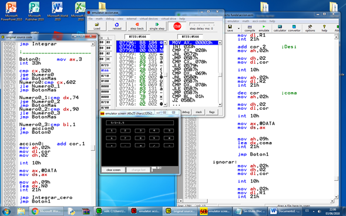

# 🧮 Basic Graphic Calculator — Assembly x8086

##  Project Overview

This is a **basic graphical calculator** built entirely using **Assembly x8086 architecture**.  
It performs arithmetic operations using low-level instructions and DOS interrupts.
---
## ⚙️ Features
- ➕ Addition  
- ➖ Subtraction  
- ✖️ Multiplication  
- ➗ Division  
- 💾 Integer and floating-point support  
- 🖥️ Simple graphical interface (text-based GUI in DOS)  

## 🖼️ Screenshots

   
  <em>Calculator logic running in EMU8086 environment</em>

   
  <em>Graphical calculator performing a division operation</em>

